# 🔎 Web Search Agent with LangChain and Llama 3.3

使用 LangChain 和 Llama 3.3 70B 構建的智能網路搜索代理，能夠從 ArXiv 和 Wikipedia 等外部知識源檢索資訊並提供準確的回答。

## 🌟 專案特色

- **多模態搜索**: 整合 ArXiv 學術論文和 Wikipedia 百科全書搜索
- **實時對話**: 基於 Streamlit 的互動式聊天介面
- **智能推理**: 使用 Llama 3.3 70B 模型進行自然語言理解和生成
- **模組化設計**: 易於擴展和維護的架構
- **錯誤處理**: 優雅的錯誤處理機制

## 🏗️ 系統架構

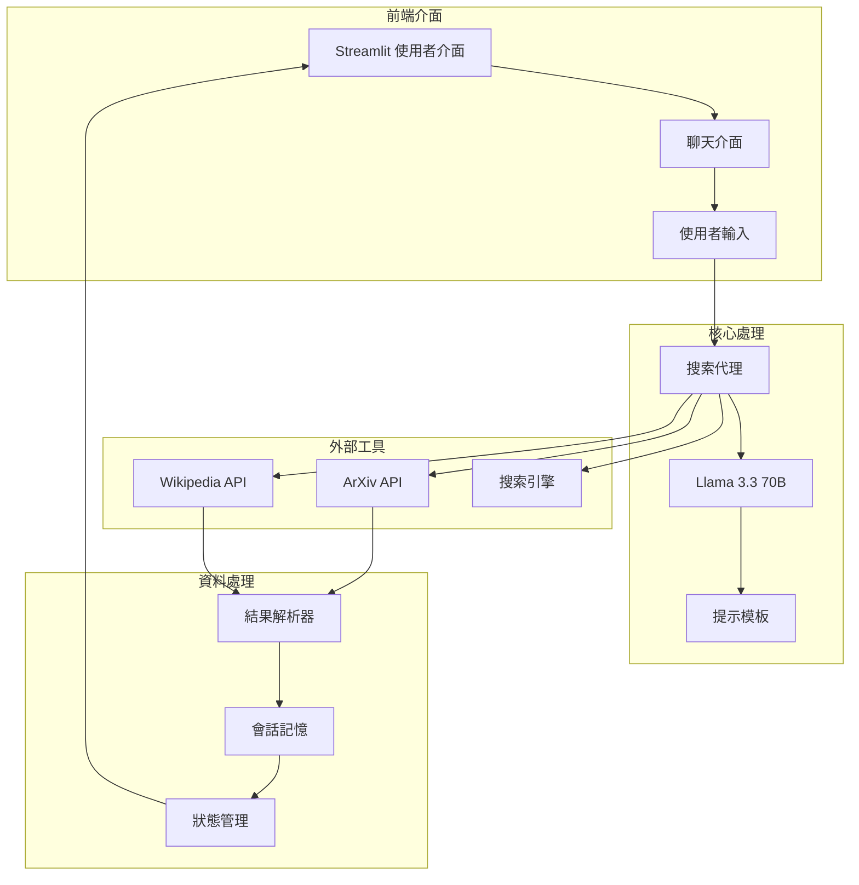

## 🔄 工作流程

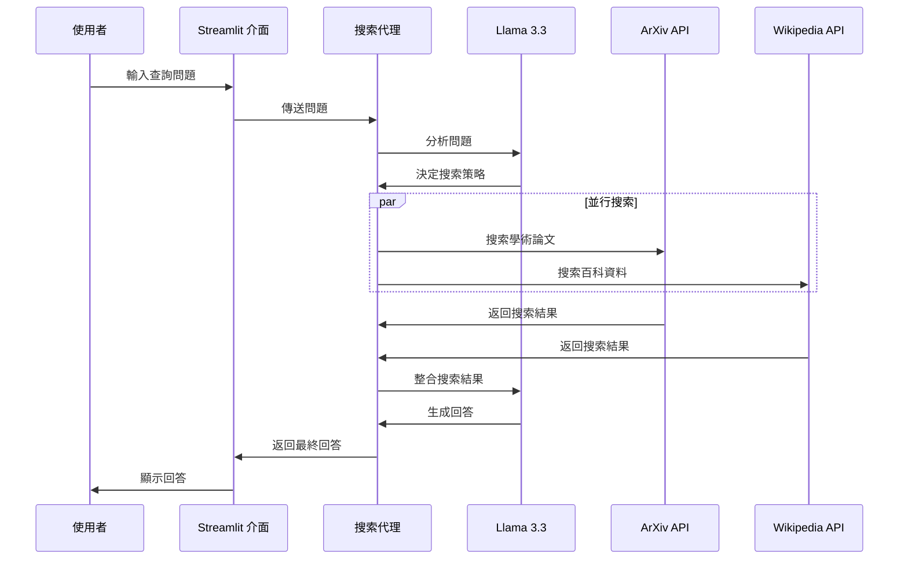

## 📦 安裝與設置

### 環境需求

- Python 3.8+
- 穩定的網路連接
- Groq API 金鑰

### 安裝步驟

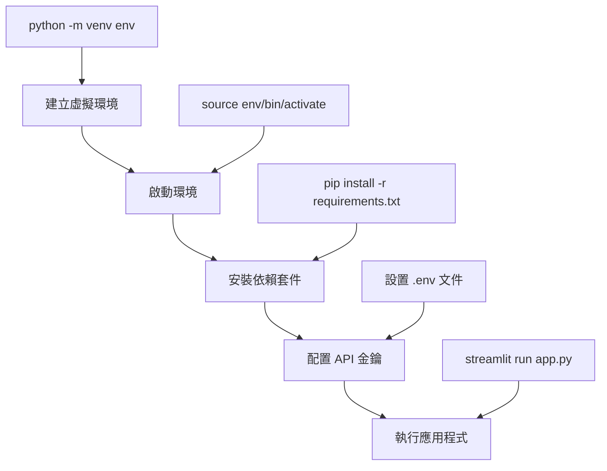

#### 1. 建立虛擬環境

```bash
# 建立虛擬環境
python -m venv env

# Windows 啟動
.\env\Scripts\activate

# macOS/Linux 啟動
source env/bin/activate
```

#### 2. 安裝依賴套件

```bash
# 方法一：直接從本專案安裝
pip install -r requirements.txt

# 方法二：從原作者 GitHub 安裝
pip install -r https://raw.githubusercontent.com/Gouravlohar/Search-Agent/refs/heads/master/requirements.txt

# 方法三：手動安裝核心套件
pip install streamlit langchain langchain-community langchain-groq python-dotenv arxiv wikipedia requests
```

#### 3. 配置 API 金鑰

建立 `.env` 文件並添加您的 Groq API 金鑰：

```env
GROQ_API_KEY="your_api_key_here"
```

> 📝 **取得 API 金鑰**: 訪問 [Groq 官網](https://groq.com) 註冊並獲取免費的 API 金鑰

## 🚀 使用方法

### 啟動應用程式

```bash
streamlit run app.py
```

### 功能展示

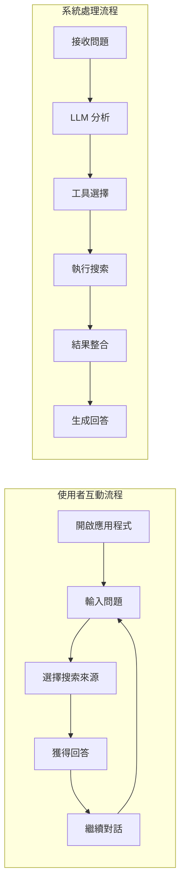

## 🛠️ 技術架構詳解

### 核心組件

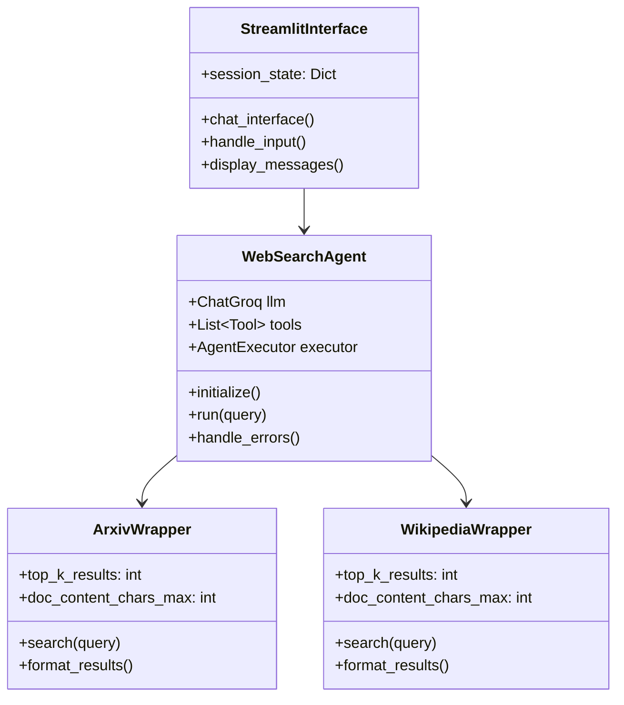

### 資料流程

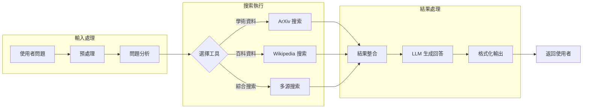

## 📚 API 參考

### 主要類別

#### `WebSearchAgent`
負責協調整個搜索流程的核心類別。

```python
class WebSearchAgent:
    def __init__(self, api_key: str, model_name: str):
        self.llm = ChatGroq(groq_api_key=api_key, model_name=model_name)
        self.tools = [ArxivQueryRun(), WikipediaQueryRun()]
    
    def search(self, query: str) -> str:
        """執行搜索並返回結果"""
        pass
```

#### `ToolWrapper`
封裝外部 API 調用的基礎類別。

```python
class ToolWrapper:
    def __init__(self, top_k_results: int = 1, doc_content_chars_max: int = 200):
        self.top_k_results = top_k_results
        self.doc_content_chars_max = doc_content_chars_max
```

## 🎯 使用案例

### 學術研究

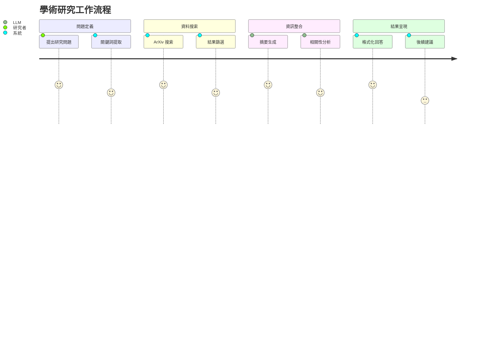

### 知識查詢

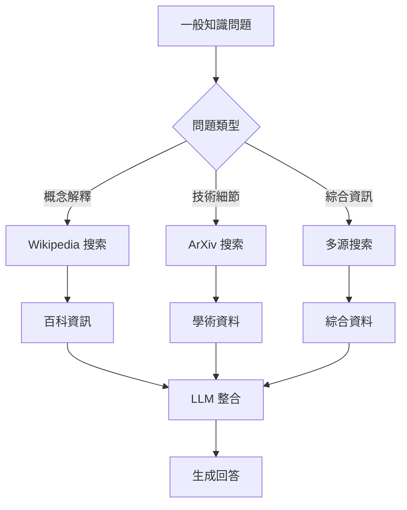

## ⚙️ 配置選項

### 模型參數

| 參數 | 預設值 | 說明 |
|------|--------|------|
| `model_name` | "llama-3.3-70b-versatile" | 使用的 LLM 模型 |
| `streaming` | `True` | 是否啟用串流回應 |
| `top_k_results` | `1` | 每個工具返回的結果數量 |
| `doc_content_chars_max` | `200` | 文檔內容最大字符數 |

### 環境變數

```env
# 必需
GROQ_API_KEY=your_groq_api_key

# 可選
MODEL_NAME=llama-3.3-70b-versatile
MAX_TOKENS=4096
TEMPERATURE=0.7
```

## 🔧 自定義和擴展

### 添加新的搜索工具

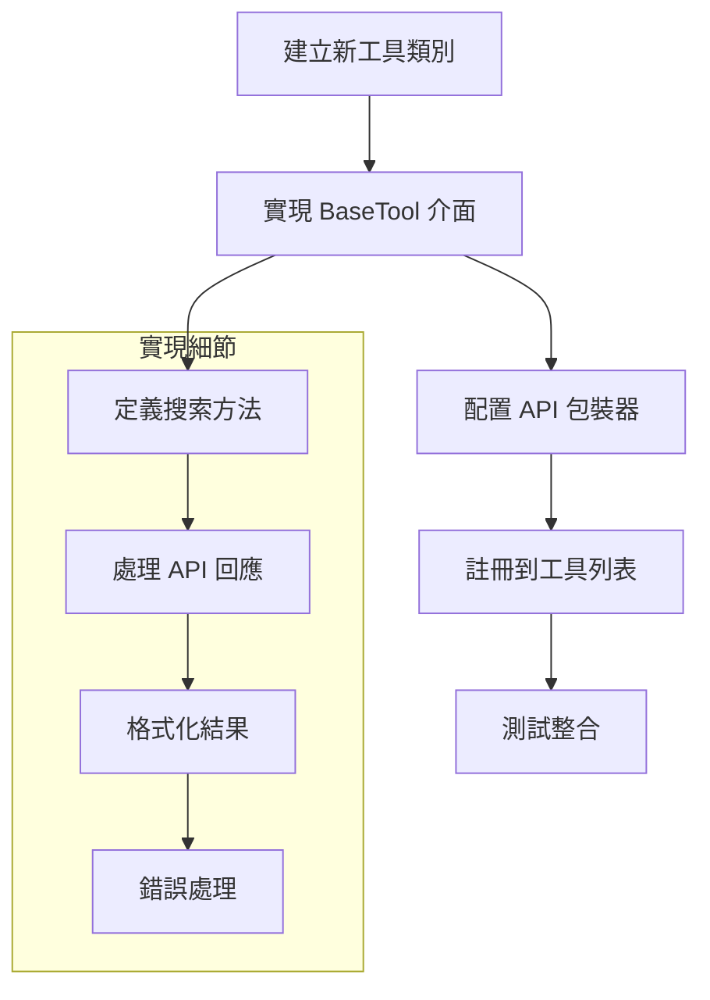

### 範例：添加 Google Scholar 工具

```python
from langchain.tools import BaseTool

class GoogleScholarTool(BaseTool):
    name = "google_scholar"
    description = "搜索 Google Scholar 學術文獻"
    
    def _run(self, query: str) -> str:
        # 實現 Google Scholar API 調用
        pass
```

## 🐛 故障排除

### 常見問題

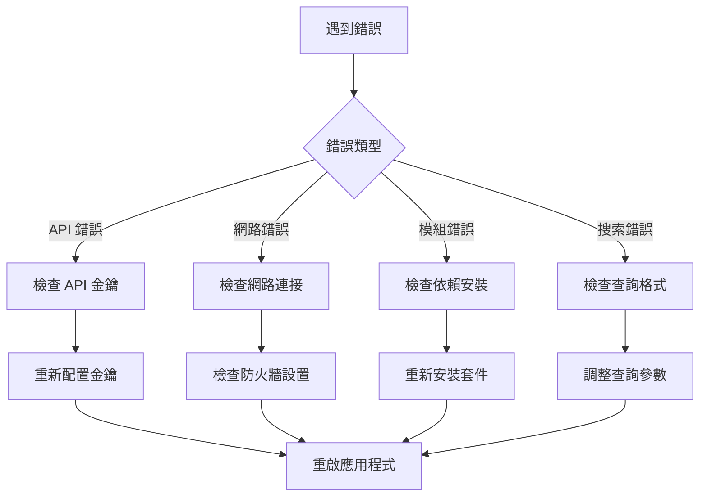

### 除錯步驟

1. **檢查日誌**: 查看詳細的錯誤資訊
2. **驗證配置**: 確認所有配置參數正確
3. **測試連接**: 驗證外部 API 的連接狀態
4. **更新依賴**: 確保所有套件為最新版本

## 📈 效能優化

### 快取策略

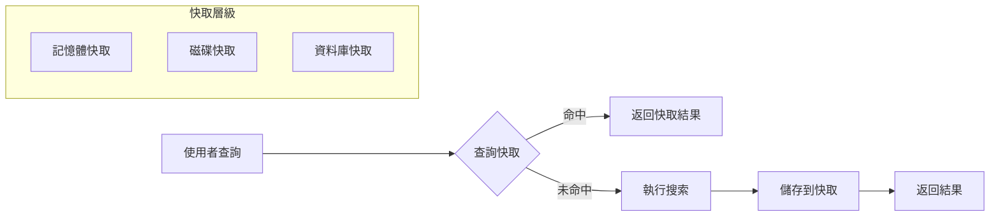

### 效能監控

- **回應時間**: 監控平均回應時間
- **API 調用次數**: 追蹤外部 API 使用量
- **錯誤率**: 監控系統錯誤發生率
- **使用者滿意度**: 收集使用者回饋

## 🤝 貢獻指南

### 開發流程

```mermaid
gitgraph
    commit id: "初始化專案"
    branch develop
    checkout develop
    commit id: "新功能開發"
    commit id: "測試完成"
    checkout main
    merge develop
    commit id: "發布版本"
```

### 提交規範

- `feat`: 新功能
- `fix`: 錯誤修復
- `docs`: 文檔更新
- `style`: 代碼格式調整
- `refactor`: 代碼重構
- `test`: 測試相關
- `chore`: 構建過程或輔助工具的變動

## 📄 授權條款

本專案採用 MIT 授權條款。詳細資訊請參閱 [LICENSE](LICENSE) 文件。

## 📞 聯絡方式

- **作者**: Gourav Lohar
- **問題回報**: [GitHub Issues](https://github.com/Gouravlohar/Search-Agent/issues)
- **功能建議**: [GitHub Discussions](https://github.com/Gouravlohar/Search-Agent/discussions)

## 🙏 致謝

感謝以下開源專案和服務：

- [LangChain](https://langchain.com/) - 強大的 LLM 應用框架
- [Streamlit](https://streamlit.io/) - 簡潔的 Web 應用框架  
- [Groq](https://groq.com/) - 高效能的 AI 推理平台
- [ArXiv](https://arxiv.org/) - 開放存取的學術論文庫
- [Wikipedia](https://wikipedia.org/) - 自由的百科全書

---

⭐ 如果這個專案對您有幫助，請給我們一個星星！